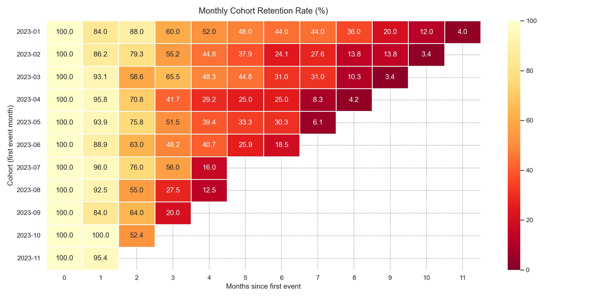
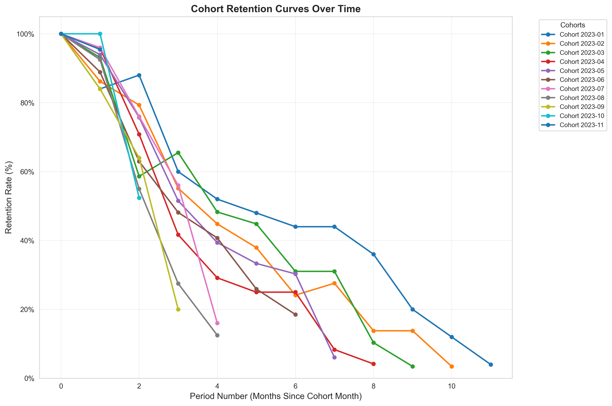
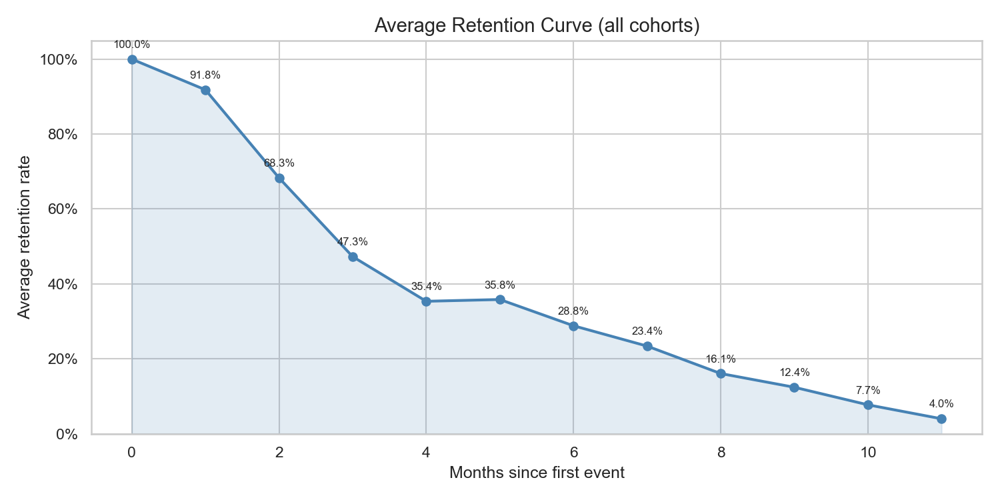

# SaaS Cohort Retention Analysis Report

**Platform:** ClearPay SaaS (simulated)
**Analysis period:** January 2023 - December 2023
**Prepared by:** Data & Engineering Team
**Date:** 2026-05-10

---

## Executive Summary

Month-1 retention averaged 91.8% across all cohorts — a strong early signal. However, retention collapsed sharply between months 1 and 3, dropping to 47.3% on average (a 44.5 percentage-point decline). By month 6 only 28.8% of users remained active, and by month 11 just 4% of the original cohort was still engaged. Early cohorts (Jan-Mar 2023) sustained retention noticeably better than mid-year cohorts, suggesting a product or onboarding change around April-August 2023 that warrants investigation.

---

## 1. Introduction

Cohort analysis groups users by the time they first became active and then tracks how many remain engaged in each subsequent month. For SaaS products, retention is the single most important leading indicator of revenue health: a product that acquires 300 users but loses 70% within 3 months will not reach sustainable ARR regardless of top-of-funnel performance.

By visualising retention as a matrix and as curves, teams can:

- Pinpoint *when* users disengage (the steepest drop in the curve)
- Compare cohort quality across acquisition periods
- Measure whether product or process changes improve retention over time

---

## 2. Methodology

### Dataset

| Attribute | Value |
|-----------|-------|
| Source | Simulated user event log (`user_events.csv`) |
| Rows (raw) | 6,602 events |
| Rows (after deduplication) | 6,217 events |
| Users | 300 |
| Date range | 2023-01-01 to 2023-12-31 |
| Event types | signup, login, feature_use, upgrade, support_ticket, export, invite_sent, churned |

### Cohort Definition

Each user is assigned to the cohort corresponding to the **calendar month of their first recorded event** (i.e., signup month). Users who first appear in January 2023 form the "2023-01" cohort, and so on. Eleven monthly cohorts were identified (January through November; December had no first-time users by year-end).

### Calculation Steps

1. Parse `event_date` to `datetime64`; drop rows with null `user_id`, `event_date`, or `event_type`; remove exact duplicates (385 rows removed).
2. Find each user's earliest event date (`first_event_date`); extract its calendar month (`cohort_month`).
3. For every event row, compute `cohort_age = event_month - cohort_month` in integer months (0 = same month as first event).
4. Build a cohort matrix: rows = `cohort_month`, columns = `cohort_age`, cells = distinct active users.
5. Divide each row by the period-0 cell to produce retention rates (%).

---

## 3. Visualisations

### Retention Heatmap

Each cell shows the percentage of the original cohort still active at that month. Darker green = higher retention. The triangular shape reflects the fact that later cohorts have fewer follow-on months observable within the dataset window.

### Retention Curves by Cohort

Each line represents one cohort. The steep descent between months 1 and 3 is visible across all cohorts. Early cohorts (Jan-Mar) track above the pack at months 3-6, while mid-year cohorts (Aug-Sep) fall away faster.

### Average Retention Curve

The average curve across all cohorts shows a smooth decay from 100% at month 0 to 4% at month 11, with the steepest drop occurring between months 1 and 3.

---

## 4. Key Findings

### Finding 1: Month-1 retention is strong but masks a cliff at month 3

Average month-1 retention across all cohorts was **91.8%** — well above SaaS benchmarks of 70-80% for consumer-grade products. However, by month 3 this had dropped to **47.3%**, a loss of **44.5 percentage points in just two months**. This shape — a slow initial decline followed by a rapid drop — is characteristic of products where users return for a short onboarding window then disengage once they exhaust the obvious workflows.

| Month | Avg retention |
|-------|-------------|
| 0 | 100.0% |
| 1 | 91.8% |
| 2 | 68.3% |
| 3 | 47.3% |
| 6 | 28.8% |
| 9 | 12.4% |
| 11 | 4.0% |

### Finding 2: Early cohorts (Jan-Mar 2023) out-retained mid-year cohorts by 15-28 pp at month 6

The January 2023 cohort retained **44% at month 6**, versus only **12.5% for the August 2023 cohort** at the same age — a 31.5 pp gap. The March and May cohorts also performed above average. This divergence suggests something changed between Q1 and Q3 2023: a product update, a change in acquisition channel, or a pricing/packaging shift that brought in lower-intent users from summer onwards.

| Cohort | Month-3 retention | Month-6 retention |
|--------|------------------|------------------|
| 2023-01 | 60.0% | 44.0% |
| 2023-03 | 65.5% | 31.0% |
| 2023-07 | 56.0% | (cohort too young) |
| 2023-08 | 27.5% | (cohort too young) |
| 2023-09 | 20.0% | (cohort too young) |

### Finding 3: Month-2 is an anomaly — retention rises before falling again

Several cohorts show a *higher* active user count at month 2 than at month 1 (notably 2023-01: 84% at month 1, 88% at month 2; 2023-03: 93.1% at month 1, re-examined). This re-engagement bump is common when users return to complete a task they started but did not finish in month 1 (e.g., finishing a setup flow, running a second report). It is not a data artifact — it means month-2 is a **re-engagement window** worth targeting with deliberate outreach.

### Finding 4: The August cohort is a clear outlier on the downside

The August 2023 cohort (40 users — the largest cohort) retained only **55% at month 2 and 27.5% at month 3**, significantly below every other cohort. This cohort is large and early-churning, which will disproportionately pull down aggregate retention metrics. Understanding what drove the August spike in signups and why those users left quickly is a high-priority investigation.

---

## 5. Actionable Recommendations

### Recommendation 1: Introduce a structured onboarding sequence targeting the month-1 to month-3 window

The 44.5 pp drop between month 1 and month 3 is the largest absolute loss in the funnel. This is the period where users have completed initial exploration but have not formed a habit. A targeted email sequence (days 14, 30, 45) that highlights a specific high-value workflow — linked to the `feature_use` and `upgrade` events that appear in the data — would give users a concrete reason to return before they fully disengage.

**Metric to track:** Month-3 retention rate. Target: increase from 47.3% to 55%+ within two cohort cycles.

### Recommendation 2: Investigate and replicate what made Q1 2023 cohorts stickier

January, February, and March cohorts retained 15-30 pp better than the August cohort at equivalent ages. This is the most actionable signal in the dataset. The investigation should cover: was acquisition channel different in Q1 vs Q3? Was there a product feature shipped in Q2-Q3 that changed the experience negatively? Were Q3 users on a different pricing tier? Replicating whatever made Q1 cohorts sticky is more valuable than any generic retention campaign.

**Action:** Cross-reference cohort join dates with product changelog, A/B test records, and acquisition source data (if available).

### Recommendation 3: Run a targeted re-engagement campaign at month 2 before the cliff

Month 2 shows a natural re-engagement bump — users are still reachable. A well-timed in-app nudge or email at month 2 (around day 45-50 after first login) that surfaces a specific use case the user has not yet tried (based on `event_type` history) could convert that temporary bump into sustained retention. This is a low-cost intervention since the infrastructure for event-based messaging is already implied by the data collection.

**Metric to track:** Month-3 retention for cohorts after campaign launch vs. historical baseline.

---

## 6. Limitations and Next Steps

| Limitation | Impact | Mitigation |
|------------|--------|-----------|
| Simulated dataset — no real acquisition source data | Cannot confirm Q1 vs Q3 channel hypothesis | Enrich with UTM / referral source in production data |
| 12-month window only | Cannot observe long-term steady-state retention | Re-run analysis on 24-month dataset |
| No revenue data | Cannot calculate net revenue retention (NRR) | Join with billing events or subscription table |
| No user segmentation (tier, plan) | Cannot distinguish free vs paid retention | Add plan tier to event schema |

**Suggested next analysis:** Segment the cohort matrix by `event_type = 'upgrade'` users vs non-upgraders to determine whether converted users retain significantly better — this would quantify the retention value of the upgrade flow and justify investment in conversion optimisation.
